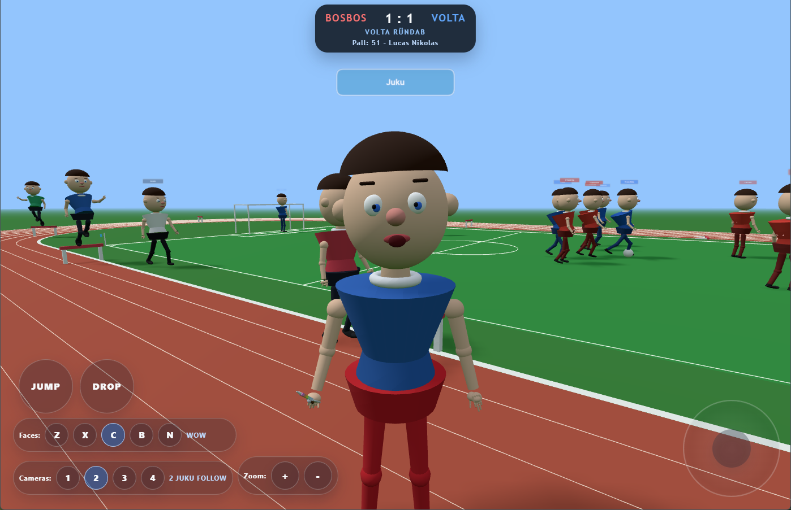

# Juku's World in WebGL



Juku's World is a browser-based WebGL sports playground built with `three` and `vite`. You control Juku inside a small stadium world with a live football match, a running track, multiple camera modes, expressive face controls, goal overlays, replay rendering, and installable PWA support.

The app is currently configured for deployment at `https://juku.mella.ee/`.

## Highlights

- Real-time 3D scene rendered with `three`
- Playable Juku character with movement, jumping, facial-expression controls, and a pick-up/drop sword interaction
- Autonomous football simulation with team presentation, AI-driven player behavior, scoreboard updates, goal celebration overlays, and slow-motion replay
- Running track environment with race timing, runners, and hurdle gameplay logic
- Multiple camera modes, zoom controls, and picture-in-picture / replay views
- Touch-first mobile UI alongside keyboard controls
- Progressive Web App setup with manifest, icons, offline precache, and versioned service worker cache

## Gameplay Snapshot

- You directly control Juku, while the football match simulation runs on its own in the stadium
- Each session builds one live `6v6` football match from the configured team pool
- Two teams are chosen at random from the available world data and assigned to the red and blue scoreboard slots
- The stadium also includes an `8`-lane running track, `8` runners, a track timer, and hurdle systems
- Goal scoring triggers a presentation flow with scoreboard updates, a large goal overlay, and a replay card

## Tech Stack

- `Vite`
- `Three.js`
- Plain HTML, CSS, and JavaScript modules

## Getting Started

### Prerequisites

- A current Node.js LTS release
- `npm`

### Install dependencies

```bash
npm install
```

### Start the dev server

```bash
npm run dev
```

### Build for production

```bash
npm run build
```

### Preview the production build

```bash
npm run preview
```

## Available Scripts

| Command | What it does |
| --- | --- |
| `npm run dev` | Starts the Vite development server. |
| `npm run pwa:sync` | Regenerates `public/sw.js` and `public/version.json` from the current `package.json` version. |
| `npm run build` | Runs the PWA sync step, builds the app with Vite, then rewrites `dist/sw.js` with the final hashed asset list. |
| `npm run preview` | Serves the production build locally. |
| `npm run deploy:package` | Copies `dist/` into `release/juku-web-v<version>/` and writes `deploy-info.json` for deployment handoff. |

## Controls

### Keyboard

| Input | Action |
| --- | --- |
| `Arrow Up` / `Arrow Down` | Move forward / backward |
| `Arrow Left` / `Arrow Right` | Turn Juku |
| `Enter` | Jump |
| `E` | Drop or pick up the sword |
| `1` `2` `3` `4` | Switch camera mode (`FREE`, `JUKU FOLLOW`, `TV 2IN1`, `TOP DOWN`) |
| `+` / `-` or mouse wheel | Zoom camera |
| `Z` `X` `C` `B` `N` | Set face to calm, angry, surprised, happy, or sad |
| `V` | Return face control to auto mode |
| `F` | Pause / resume football simulation only |
| `R` | Pause / resume track timer only |

### Touch UI

- Left joystick controls movement and turning
- `JUMP` triggers jumping
- `DROP` / `PICK UP` toggles the sword interaction
- Camera buttons `1-4` switch views
- Face buttons change expressions
- `+` and `-` adjust zoom

## Camera Modes

| Key | Mode | Purpose |
| --- | --- | --- |
| `1` | `FREE` | General roaming camera around Juku |
| `2` | `JUKU FOLLOW` | Closer follow camera focused on Juku |
| `3` | `TV 2IN1` | Broadcast-style football framing with PiP support |
| `4` | `TOP DOWN` | High overhead tactical view |

## How the App Starts

The startup path is intentionally split so the browser loads a tiny entry first and defers the heavier app bootstrap to the next animation frame.

```text
src/main.js
  -> lazy imports src/app-bootstrap.js
     -> loadWorldCharacterData()
     -> createUi()
     -> build scene, track, football game, and Juku
     -> setupUiInputSystem()
     -> createAppRuntime()
     -> start animation loop
     -> register service worker in production
```

## Project Structure

```text
.
|-- index.html
|-- public/
|   |-- app-icons/
|   |-- data/
|   |   `-- world-character-data.json
|   |-- images/
|   |-- manifest.webmanifest
|   |-- sw.js
|   `-- version.json
|-- scripts/
|   |-- finalize-pwa-build.mjs
|   |-- package-deploy.mjs
|   |-- pwa-utils.mjs
|   |-- sw.template.js
|   `-- sync-pwa-version.mjs
|-- src/
|   |-- app-bootstrap.js
|   |-- app-runtime.js
|   |-- football-*.js
|   |-- juku-*.js
|   |-- ui*.js
|   |-- world-*.js
|   `-- main.js
|-- vite.config.js
`-- package.json
```

## Key Files

- `src/main.js`: minimal browser entry that schedules the lazy bootstrap
- `src/app-bootstrap.js`: builds the renderers, scene, UI, world objects, runtime wiring, and frame loop
- `src/app-runtime.js`: coordinates camera and Juku updates each frame
- `src/track-system.js`: track geometry, lane layout, finish line, and start block generation
- `src/ui-input-system.js`: keyboard, mouse-wheel, and touch control wiring
- `src/football-bridge.js`: connects match simulation, scoreboard, overlays, and replay hooks
- `src/football-match-runtime.js`: top-level football orchestration
- `src/football-player-runtime.js`: per-player football update coordinator
- `src/camera-system.js`: free camera, follow camera, split/broadcast-style view, top-down view, and zoom handling
- `src/world-character-data.js`: normalization, fallback data, and random team matchup selection
- `public/data/world-character-data.json`: data-driven character, runner, referee, and football team definitions

## Data-Driven Content

The world setup is not hard-coded entirely in the runtime. `public/data/world-character-data.json` provides:

- Juku's name, hair style, and colors
- Referee presentation data
- Track runner names and speed profiles
- Football team identities, colors, and player rosters

At startup, the app normalizes that JSON and randomly picks a red team and a blue team from the available team pool. If loading the JSON fails, the runtime falls back to embedded default data in `src/world-character-data.js`.

If you want to tweak the cast, team branding, roster names, or the matchup pool itself, this JSON file is the first place to edit.

## Common Customizations

| What you want to change | Where to edit |
| --- | --- |
| Team names, player rosters, runner names, Juku colors | `public/data/world-character-data.json` |
| Physics values, camera defaults, replay timing, football behavior preset | `src/game-config.js` |
| Page title, social metadata, install metadata link tags | `index.html` |
| PWA install name, orientation, start URL, scope, icon paths | `public/manifest.webmanifest` |
| Build chunking strategy | `vite.config.js` |

The football behavior system already defines both `arcade` and `realistic` presets in `src/game-config.js`, with `arcade` currently set as the default preset for new sessions.

## PWA and Versioning

The app version lives in `package.json` under `"version"`. That version is reused across the PWA and deployment flow.

During `npm run pwa:sync`:

- `public/version.json` is regenerated
- `public/sw.js` is rebuilt from `scripts/sw.template.js`
- the cache name is updated with the current app version

During `npm run build`:

1. The public PWA assets are refreshed from the current version.
2. Vite builds the app into `dist/`.
3. `scripts/finalize-pwa-build.mjs` rewrites `dist/sw.js` so `PRECACHE_URLS` contains the actual built asset filenames, including hashed files in `dist/assets/`.

When cached assets change, bumping the app version is the intended way to roll the service worker cache forward.

### Offline Behavior

The generated service worker:

- precaches the public app shell and generated build assets
- serves cached same-origin `GET` requests when available
- falls back to `/` or `/index.html` for navigation requests when the network is unavailable
- deletes old versioned caches during activation

## Deployment Notes

`npm run deploy:package` prepares a release folder at:

```text
release/juku-web-v<version>/
```

That folder contains a copy of `dist/` plus a generated `deploy-info.json` summary.

Typical deployment flow:

1. Bump the version if cached assets changed.

```bash
npm version patch
```

2. Build the app.

```bash
npm run build
```

3. Prepare the release package if you want a versioned deploy folder.

```bash
npm run deploy:package
```

4. Publish the contents of `dist/` or the generated release folder.

For the current production setup, these URLs should resolve successfully after deploy:

- `https://juku.mella.ee/`
- `https://juku.mella.ee/manifest.webmanifest`
- `https://juku.mella.ee/sw.js`
- `https://juku.mella.ee/version.json`
- `https://juku.mella.ee/app-icons/icon-192.png`
- `https://juku.mella.ee/app-icons/icon-512.png`

## Metadata and Hosting Assumptions

- `index.html` includes Open Graph and Twitter card metadata for `https://juku.mella.ee/`
- The current build assumes root hosting rather than a nested subpath
- The production service worker is only registered in `import.meta.env.PROD`
- `public/manifest.webmanifest` currently uses `/` for `id`, `start_url`, and `scope`, and root-relative icon paths under `/app-icons/`

If you move this app off the production root domain, update `index.html`, `public/manifest.webmanifest`, and any related deployment/base-path assumptions together.

## Development Notes

- `src/main.js` is intentionally tiny to improve initial loading behavior
- `vite.config.js` defines manual chunks so major football and vendor code can be split more deliberately
- The service worker generated in production intentionally excludes `sw.js` itself from the precache list
- No standalone license file is currently included in the repository
